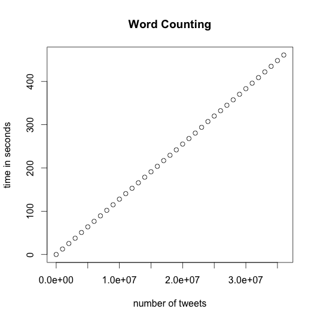

Insight - Coding Challenge
===========================================================

#### Author : Daoyan Wang

The description of the problem can be found [here](https://github.com/InsightDataScience/cc-example)
at the github of the "Insight Data Science", or [here](https://github.com/rarenaturew/insight_coding_challenge/blob/master/Insight_instruction.md).

### Functionality of the package
The purpose of this package is to help analyzing the community of Twitter users. 
The tweets are put in a single text file (tweets.txt) where each line is a tweet,
and anything seperated by white space are regarded as words. This package include
two programs performing the following two tasks:

1. **word_tweeted.py** : calculate the total number of times each word has been tweeted.
2. **median_unique.py** : calculate the median number of unique words in each tweet, and update this median as tweets come in. 

The first program produces file **ft1.txt** which includes the following total count for each word:

	word1         1
	word2         7
	word3         3

Here the words are sorted alphabetically in the file.

The second program produces file **ft2.txt** which includes running median number of unique words in each tweet. For example, if the numbers of the unique words of the first three tweets are 11, 14, and 17, then the running median of the first three outputs are:

	11
	12.5
	14

### Usage: run.sh \<option\>                                                    
Your computer should have **Python 2.7** installed. The programs can be executed by simply "run.sh \<option\>", here the \<option\> is optional. 

         The default option is "no option": no data munging. We can simply run "run.sh"             
                                                                             
         If <option> is not empty: capital letters are converted into lower cases, 
                                   and empty lines are ignored. 
                                   Try: " run.sh 1 "                         

When the option is not empty, the output files are named **ft1_\<option\>.txt** and 
**ft2_\<option\>.txt**.


### The performance

This package can deal with large files that are larger than the RAM of the computer
because the data is read and processed line by line. The programs are scalable according to the
size of the input files. The time spent is **proportional** to the size of the input files.
This is confirmed by the following two figures, which show the time spent for a test data file with more than **35,000,000** lines (tweets), which is about **4.2G** in size. Note this
size is **greater than** the RAM of my machine. 
The test was performed under Mac OS X Yosemite on MacBook Air (13-inch, Mid 2013)
with processors (1.3 GHz Intel Core i5) and RAM (4 GB 1600 MHz DDR3).

   

### The details of the implementation 

The key feature of the programs is the scalability. 
To make it possible, the main operations should be scalable. 
Therefore, we read and process the file line by line.
To realize the scalability, the time complexity of 
the processing time for each
line must be **O(1)**. We will focus on the realization of
this O(1) processing time. 

Notation: let **N_L** be the number of lines that need to 
be processed in the input file.

#### Word counting

For both programs, we need to process data in some kind of series manner.
For word counting program, we need to maintain a list of words with
their running counts. When a new word comes in, we need to locate
where the word fit into the list. The time complexity of 
this operation, locating the position of a given word in a list, 
is normally **O(N_w)**, here N_w is the number of distinguishable
words, which is pretty large. Fortunately, in Python, there is a 
very nice data structure: **dictionary**. Because
it uses hash table, the time complexity to locate a particular key in a 
dictionary is (on average) **O(1)**. i.e. the time to locate a key does
not depend on N_w. Therefore we decide to use dictionary to record
the words and their counts. The structure of the dictionary is:

     word_count_dict = {word1: count1, word2:count2, ...}

When processing the lines, we locate each word in this dictionary and 
increase its count. This operation, as stated above, is independent 
of N_w. After we loop over the file, we sort the dictionary
keys alphabetically, and then simply write the dictionary to file *ft1.txt*
according to the order of the sorted keys. 


#### Running median
First of all, please note the number of distinct words in a given tweet
has an upper limit (denoted by **N_t**), due to the restriction of the
length of a tweet. Currently *twitter* do not allow the length exceed 160 characters,
therefore the maximal value of N_t is only 80. Actually we do not care about
the specific value of N_t. Instead, what's important is that there **exists** 
this upper limit of N_t. Therefore any operation that is solely 
determined by N_t, has nothing to do with N_L (the number of total lines
that is needed to be processed), which is therefore O(1).

To realize the O(1) dependence of the running median calculation, we use a dictionary
to keep the possible values of the number of unique words in a tweet, and their counts.
For example, if there are 7 tweets which numbers of unique words are: 
3,2,4,4,3,4,3,  the dictionary is then 

        dict = {3:3,2:1,4:3}
We then sort the keys of the dictionary. From the dictionary and the sorted keys, 
we can calculate the median as 

        median = 3
Now we add in the 8th tweet, whose number of unique words is 5, now the dictionary
is changed into

        dict = {3:3,2:1,4:3,5:1}
and the median is now calculated as 

        median = (3+4)/2 = 3.5
In general, the running median is calculated as follows. Given an ordered 
sequence of numbers whose length is **N_lines**, the median is 
either the value at *position*=*(N_lines+1)/2* (if *N_lines* is odd) or the average 
of the value at *position*=*N_lines/2* and the value at *position*=*N_lines/2 + 1* 
(if *N_lines* is even). Therefore this problem can be considered solved if
we can obtain the value at *position* of the ordered sequence.

Our *dict* and its sorted keys (*sorted_keys*), is equivalent to the ordered sequence. 
For example, from the *dict = {3:3,2:1,4:3,5:1}* and its sorted keys *sorted_keys=[2,3,4,5]*, 
we obtain the ordered sequence as *[2,3,3,3,4,4,4,5]*. From this sequence we can 
obtain the value at any position. Of course, we do not explicitly obtain 
the ordered sequence --- this is the whole point of using the *dict*. 
Instead of explicitly obtaining the ordered sequence, we **calculate** the value
at *position* in this ordered sequence. This can be obtained by the following 
Python code

```python
def value_at(position,dict,sorted_keys):
  p = 0 # to accumulate the counts from smallest num_of_unique_words in the ordered sequence
  for k in sorted_keys:
    p = p + dict[k]
    if (p >= position) : # found it!!!!
      the_value = k # this is the value at 'position' of the sorted sequence
      break
  return the_value
```

Note, when calculating the running median, the only objects we need are: 
the dictionary (*dict*), its sorted keys (*sorted_keys*), 
and the total number of lines (*N_lines*). 
The time spent to calculate the running median only depend on N_t, which
is a **fixed** amount, therefore O(1). Here the *sorted_keys* is optional, because it can be
obtained from *dict*. However, maintaining a sorted key vector *sorted_keys* 
can save time. Instead of sorting the keys of *dict* each time when a new tweet comes in,
we now only update *sorted_keys* if the "number of unique words" of the new tweet
is not already in the keys of *dict*, otherwise the *sorted_keys* remains the same.
Note there are only 0.5\*N_t possible keys, therefore we only do sorting at most 0.5\*N_t times,
which make the sorting time essentially negligible. 

### Summary
This package can deal with large files whose sizes are larger than the RAM of the machine, 
and the time complexity is O(N): the duration of the execution time is 
proportional to the size of the input data file. 
